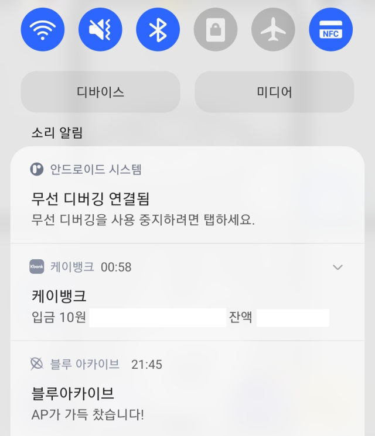

# kotama
android notification → wiretap → google sheet

## 목적

결제, 출금, 입금 같은 기록을 구글 시트로 모으고 싶다.
이런걸 손으로 시트에 입력하는건 너무 귀찮다.
android notification을 도청하자.

## 준비물

### google sheet

1. Google 스프레드시트 생성
2. 첫번째 행은 필드로 사용된다. 대충 채워둔다.
    * id
    * key
    * postTime
    * packageName
    * title
    * text
    * bigText
    * infoText
    * subText
    * summaryText
3. 확장 프로그램 -> Apps Script
4. Apps Script 프로젝트 이름 적당히 설정
5. `gsheet/code.js` 복사해서 `Code.gs` 채우기
6. 배포 -> 새배포
    * 유형 선택: 웹 앱
    * 설명: 적당히 채우기
    * 다음 사용자 인증 정보로 실행: 나
    * 액세스 권한이 있는 사용자: 모든 사용자
    * 배포 -> 액세스 승인
7. 웹앱 URL을 복사해둔다.

### android studio
1. 웹앱 URL을 `MyNotificationListenerService.kt` 에 적당히 넣는다.
2. 앱을 설치하고 결제, 송금 로그가 구글시트에 기록되는지 확인한다.

## known issue

하나의 알림인데 시트에는 여러번 기록될 수 있다.
하나의 알림으로 `NotificationListenerService.onNotificationPosted` 가 한번만 호출된다고 보장되지 않더라.
`StatusBarNotification.key`로 중복을 제거하려고 했으나 삼성페이에서 문제가 발생했다.
`com.samsung.android.spay`는 서로 다른 결제에 대해서 같은 key로 알림을 보낼때가 있다.

하나의 결제는 시트에 여러번 기록될 수 있다.
은행A에서 은행B로 송긍했을때, 앱A는 출금 알림을 띄우고, 앱B는 입금 알림을 띄울 수 있다.

안드로이드 패키지 이름 기준으로 알림을 잡아서 약간의 필터링을 거친후 시트로 보냈다.
모든 금융앱을 지원하는건 아니라서 알아서 고쳐서 써야한다.
금융앱에서는 쓸데없는 이벤트, 광고 알림을 자주 보낸다. 필터링 규칙을 대충 짜서 광도도 시트로 전송된다.
